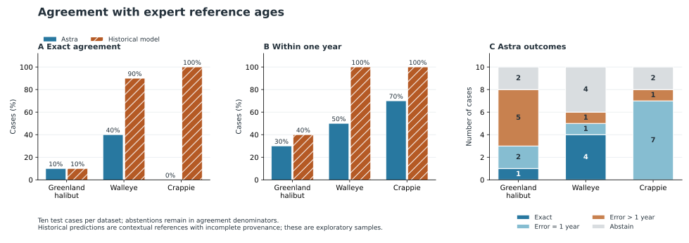
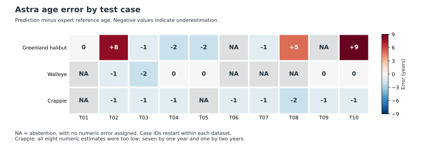
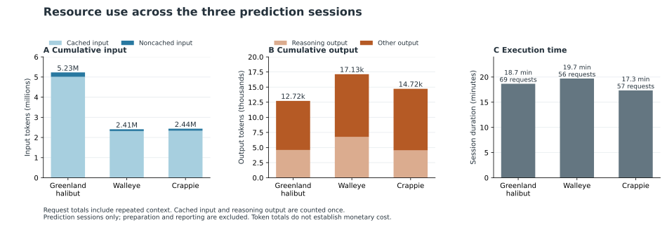

# Autonomous Otolith Age Reading with Codex and GPT-6 Astra

**Three-Trial Feasibility Report | 3 October 2026**

## 0. Main findings and workflow

**Astra could inspect otolith images and choose its own image-processing steps, but age estimates were unreliable in these three trials.** Exact agreement with expert reference ages was 10% for Greenland halibut, 40% for Walleye, and 0% for Crappie, with ten test cases per dataset. Astra withheld an age on eight of the thirty cases. All eight numeric Crappie estimates were too low, usually by one year.

**Astra and historical specialist models on the same ten cases per dataset**

| Dataset | Method | Exact | Off by one year | Error >1 year | Abstain | Within one year |
|---|---|---:|---:|---:|---:|---:|
| Greenland halibut | Astra | 1 | 2 | 5 | 2 | 30% |
| Greenland halibut | ResNet-18 + linear regression head* | 1 | 3 | 6 | 0 | 40% |
| Walleye | Astra | 4 | 1 | 1 | 4 | 50% |
| Walleye | ConvNeXt-Tiny + linear regression head | 9 | 1 | 0 | 0 | 100% |
| Crappie | Astra | 0 | 7 | 1 | 2 | 70% |
| Crappie | ConvNeXt-Tiny + linear regression head | 10 | 0 | 0 | 0 | 100% |

*The Greenland architecture is identified from the archived implementation. Its exact checkpoint and the binding between that implementation and the saved predictions remain unverified.

The four outcome counts sum to ten in each row. “Off by one” means an absolute error of exactly one year after rounding; within-one-year agreement includes both Exact and Off by one, with all ten cases in the denominator. Astra’s Exact rates were **10%, 40%, and 0%**, compared with **10%, 90%, and 100%** for the historical models. Abstentions represent withheld age estimates; all three Astra sessions completed without recorded command failures or model-request retries.

MAE is also available in Tables 3 and 4. Astra’s values cover only its 8, 6, and 8 numeric predictions, whereas each historical model covers all ten cases. Historical-model inference time and usage for these cases were unavailable, so a resource-cost comparison cannot be made. The existing predictions were reused without retraining or rerunning any model.

The existing specialist-model predictions were more accurate on the two freshwater samples. Their training and model-selection histories were only partly verified, so they serve as historical context. These small trials do not establish general performance or isolate the effect of changes in reading guidance. The clearest next step is to check Astra’s band interpretations against expert-marked annuli and the dataset’s actual counting rules before adding more cases.

**The work followed five steps:**

1. **Prepare each trial.** Select five labeled reference images from the training/development side and ten anonymous test cases from an existing evaluation pool.
2. **Give Astra the task and references.** Use a separate execution session with the existing model, reading instructions, and local image tools. Keep test ages outside the prediction session.
3. **Let Astra inspect and decide.** View all original images, create crops or enlarged views as needed, and submit an integer age or an explicit abstention for each test case.
4. **Freeze and score.** Save all ten outputs before systematic evaluation, calculate MAE and rounded Exact/within-one-year agreement, and match existing specialist-model predictions to the same cases. Section 5 records the Walleye evaluator’s premature exposure to some age metadata; those fields did not reach the prediction session.
5. **Review behavior and resource use.** Preserve observations and processing choices, total the available usage logs, and compare the implementation with the advisor’s original plan.

The three prediction sessions took about 56 minutes and used 182 model requests. Their cumulative usage was 10,116,690 tokens, mostly cached input; monetary cost was unavailable. The following sections give the sampling, methods, results, figures, and limitations.

## 1. Purpose and experimental setup

We adapted the advisor’s proposed sonar-segmentation experiment to otolith age reading. The aim was to see how Codex and Astra used local labeled examples, what image-processing choices they made, and how much time and model usage the task required. The trials were exploratory, with accuracy measured against existing expert age estimates.

All three trials used the existing **gpt-6-astra** service with **xhigh** reasoning in separate execution sessions. The agent had access to the anonymous images, five reference ages, task instructions, and existing local image-processing tools. It could choose crops, magnification, contrast adjustments, and other classical processing. No fixed ring-counting algorithm was supplied. Additional learned models, training, software installation, and external browsing were excluded from the prediction sessions.

**Table 1. Inputs and sampling. Test cases were selected by ID; their age ranges were recorded during evaluation.**

| Dataset | Five reference ages, years | Ages in the ten evaluated cases, years | Test sampling |
|---|---|---|---|
| Greenland halibut | 7, 9, 11, 13, 21 | 6–17 | Ten publisher-key groups sampled from the existing test-side pool; seed 20261002 |
| Walleye | 2, 2, 3, 3, 4 | 2–4 | Ten case IDs sampled from 22 cases in existing outer fold 0; seed 20261003 |
| Crappie | 2, 3, 4, 5, 7 | 2–6 | Ten case IDs sampled from the existing 915-case historical evaluation set; seed 20261005 |

References came from the corresponding training/development side. Walleye references used the other outer folds; Crappie references used the existing inner-training subset. The Walleye and Crappie source pools had already been restricted historically to ages 2–4 and 2–7, respectively. Cases were not replaced based on test age, visual difficulty, or baseline error. The separate 424 protected Crappie cases were not accessed.

We report results by **case or record**. The selected records have distinct publisher keys or image IDs. Their relationships to individual fish, paired views, and derived images remain incompletely documented, so biological independence is uncertain. The reference ages are expert estimates whose agreement with true biological age has not been independently validated.

## 2. Reading guidance and observed strategies

The Greenland trial used the existing task-specific instructions and five reference images. Before the Walleye trial, relevant otolith literature and methodological guidance were reviewed, and a written guide was added. It emphasized distinguishing the core, first annulus, and outer edge; grouping visible lines into candidate annual bands; checking continuity across neighboring directions; and avoiding cracks, bubbles, and processing artifacts. The Crappie trial retained the general FAO/DFO principles while removing Walleye-specific material.

Each reference image had an expert total age. None had expert-drawn annulus boundaries. We also had incomplete information about local edge conventions, capture season, preparation, illumination, and reader adjudication. This left an important question unresolved: was Astra interpreting the bands in the same way as the original readers? The agent could predict outside the reference-age range, and its predictions received no uniform age adjustment.

**Table 2. Processing actually performed by the agent. Every trial included visual inspection of all 15 original images.**

| Dataset | Additional views inspected | Actual local processing |
|---|---:|---|
| Greenland halibut | 30 | Cropping, grayscale autocontrast, sharpening, and Lanczos resizing; additional histogram equalization for one difficult case |
| Walleye | 12 | RGB cropping and 2× bicubic enlargement; no actual contrast adjustment or sharpening |
| Crappie | 15 | RGB cropping and 1.5–2× bicubic enlargement; mild global contrast adjustment on seven views |

The agent generally followed a path from the core toward a visible edge, then checked neighboring directions or another structure in the image. Counts from two structures were kept separate. We retained the processing scripts, crop coordinates, generated views, and observation notes. Expert review would still be needed to determine whether the bands described in those notes were correctly identified as annuli.

## 3. Evaluation and results

For each test case, Astra submitted a nonnegative integer age or abstained. All ten outputs were saved and frozen before systematic scoring. The original predictions remain unchanged. We used the following scoring rules:

- **MAE:** absolute error using the original numeric prediction, before rounding.
- **Exact agreement:** rounded prediction equals the expert reference age.
- **Within-one-year agreement:** rounded prediction differs from the reference by at most one year.

Rounding was half away from zero, equivalent to half-up for nonnegative ages. Abstentions remained in the denominator of ten for both agreement rates. Because all three Astra trials included abstentions, a full-sample MAE was unavailable; the reported Astra MAE is conditional on cases receiving a numeric prediction.

**Table 3. Astra results. MAE is calculated only for cases with a numeric prediction; the sample size varies by trial.**

| Dataset | Numeric predictions | Abstentions | Conditional MAE, years | Exact agreement | Within one year |
|---|---:|---:|---:|---:|---:|
| Greenland halibut | 8/10 | 2 | 3.500 | 1/10 (10%) | 3/10 (30%) |
| Walleye | 6/10 | 4 | 0.500 | 4/10 (40%) | 5/10 (50%) |
| Crappie | 8/10 | 2 | 1.125 | 0/10 (0%) | 7/10 (70%) |

Existing specialist-model predictions were matched to the same ten cases in each trial and evaluated using the same metric definitions. No specialist model was retrained or rerun.

**Table 4. Historical specialist-model results on the same ten cases in each dataset. The comparison provides context, subject to the provenance limits described below.**

| Dataset | Existing prediction source | MAE, years; n = 10 | Exact agreement | Within one year |
|---|---|---:|---:|---:|
| Greenland halibut | ResNet-18 + linear regression head*, seed 13 | 1.7864 | 10% | 40% |
| Walleye | ConvNeXt-Tiny + linear regression head, seed 104729 | 0.2677 | 90% | 100% |
| Crappie | ConvNeXt-Tiny + linear regression head, seed 104729 | 0.1315 | 100% | 100% |

We reused the historical predictions without a new audit of the models’ full checkpoint-selection and tuning histories. The Crappie cases came from a retrospective evaluation pool. The independence and fairness of these comparisons therefore remain only partly established. The MAE denominators also differ: the specialist-model values cover all ten cases, while Astra’s values cover only cases with a numeric prediction.

**Figure 1. Agreement with expert reference ages.** Both agreement rates use all ten cases per dataset, including abstentions. The outcome counts distinguish exact estimates, one-year errors, larger errors, and abstentions. Historical predictions provide context; their full selection histories have not been audited.

The clearest failure patterns were as follows:

- **Greenland halibut:** dense or faint bands, damage, and uncertain band grouping produced both underestimation and substantial overestimation. Two images were judged unreadable.
- **Walleye:** four cases were read exactly. Both four-year-old cases were underestimated, as three and two years, and the agent abstained on four other cases. Species, images, age distribution, references, and guidance all changed between this trial and Greenland. Their separate effects on accuracy remain unknown.
- **Crappie:** all eight numeric predictions were too low. Seven were one year below the reference and one was two years below it; the agent abstained on two cases. Possible explanations include a different counting origin, an edge-convention mismatch, missed weak bands, or an interpretation bias. Expert annulus annotations would help distinguish these possibilities. We retained the original predictions without a post hoc “+1 year” correction.

**Figure 2. Case-level Astra errors, in years.** Negative values indicate underestimation. Gray NA cells mark abstentions and have no assigned numeric error. All eight numeric Crappie estimates were below the expert reference ages. The cause of this pattern remains unresolved.

## 4. Runtime and model usage

**Table 5. Measured usage of the three prediction sessions. Cached input and reasoning output are included in their respective totals.**

| Measure | Greenland halibut | Walleye | Crappie |
|---|---:|---:|---:|
| Model requests | 69 | 56 | 57 |
| Execution time | 18 min 40 s | 19 min 42 s | 17 min 21 s |
| Input tokens | 5,229,622 | 2,407,448 | 2,435,049 |
| Of which cached | 5,010,176 | 2,317,696 | 2,334,464 |
| Noncached input tokens | 219,446 | 89,752 | 100,585 |
| Output tokens | 12,717 | 17,135 | 14,719 |
| Of which reasoning | 4,595 | 6,753 | 4,530 |
| Total tokens | 5,242,339 | 2,424,583 | 2,449,768 |

The three sessions used **182 requests and 10,116,690 total tokens**, with approximately **55 minutes 43 seconds** of combined execution time. Total input was 10,072,119 tokens, including 9,662,336 cached tokens; total output was 44,571 tokens, including 15,878 reasoning tokens. Cache-write usage was recorded as zero. Request-level totals agreed with the final CLI usage records.

**Figure 3. Recorded prediction-session resource use.** Cached input is included in total input, and reasoning output is included in total output. The panels use different units for input and output. Counts accumulate across requests and include repeated context; monetary cost was unavailable.

These totals accumulate usage across requests, including repeated context and images. Much of the input was cached. Monetary charges, image-only token usage, exact usage and time per case, and the specialist models’ inference costs were unavailable. The totals cover the prediction sessions only; preparation, literature review, evaluation, report writing, earlier technical checks, and platform safety reviews are excluded. We leave per-case cost unreported because the logs provide no reliable allocation of shared context and reference-image processing.

All sessions completed without model-request retries or recorded command failures. The logs identify Astra/xhigh and also contain a CLI model-metadata fallback warning. Its effect on client behavior remains unknown.

## 5. Blinding and protocol limitations

Each prediction session used a fresh context with anonymous inputs. Test-age tables, identity mappings, historical predictions, and evaluator history were kept outside the mounted environment. Earlier access checks covered known direct paths. Other possible access routes were outside the scope of those checks.

A blinding deviation occurred in the **Walleye trial**. While looking for historical-model metadata, the parent evaluator inadvertently displayed some case-age fields before prediction had finished. The isolated Astra session did not receive those fields. Inputs, prompts, selected cases, and predictions remained unchanged. The record explicitly acknowledges that the evaluator encountered some age information before the freeze.

Each dataset contributed only ten test cases. Biological grouping, reference diversity, local reading conventions, and historical-model provenance also limit the interpretation. The trials included neither repeated runs nor a controlled comparison of prompts, and we performed no significance tests. The findings are descriptive and specific to these cases and settings.

## 6. Alignment with the advisor’s original plan

The experiments retained the original plan’s central idea: let Codex use Astra vision, local expert-labeled examples, and image tools to develop a strategy, preserve uncertainty, freeze predictions, and compare with existing model outputs while recording resource use.

The implementation differed from the original plan in several important ways. We checked all 18 sections, covering 62 substantive items. The main differences are:

| Original plan | What was implemented | Interpretation |
|---|---|---|
| Sonar semantic segmentation | Otolith integer-age prediction | Authorized task adaptation; no conclusion about sonar segmentation follows |
| Two test orthomosaics: one typical and one difficult | Ten randomly selected cases in each of three datasets | Different sampling unit, scale, and difficulty design |
| Add a third case only if initial results are promising | Additional freshwater trials explicitly requested after weak earlier results | Continuation explicitly requested by the user despite weak earlier results |
| Broad freedom, including useful local segmentation models | Five fixed references, classical tools, and no additional learned models | A narrower capability test |
| Concise goals and actual project annotation conventions | Incomplete local aging rules, supplemented by general reading guidance | The local annotation convention remained incomplete |
| Low-resolution overviews and selective expensive inspection | Every original image was required to enter vision; crops were then chosen autonomously | Cost-control guidance was only partly implemented |
| Same general instructions across the initial comparison | Species, references, and written guidance changed across trials | No controlled estimate of prompt-improvement effects |
| Per-image time/cost and spatial diagnostic outputs | Per-request usage, run-level time, scalar ages, uncertainty notes, and saved crops | Exact per-case measurement and expert-verified annulus overlays remain missing |

The consolidated tables and age-confusion summaries were prepared after the trials. The audit identifies these later additions separately from records collected during execution.

## 7. Conclusions and recommended next step

The image-handling workflow worked, while age estimates remained unreliable. The gap from the historical specialist models was especially large for the freshwater samples. Astra’s explanations often described recognizable image features, yet the link between those features and the correct annual boundaries still needs expert checking.

I recommend pausing further blind expansion until the reading convention can be checked against a small number of expert-annotated reference images. The most useful additions would identify the core, first annulus, successive annual boundaries, and the treatment of the outer edge, together with the actual dataset-specific age convention. The Crappie results give us a specific question to check: where does the agent’s count first diverge from the expert’s count?

If further work is authorized, the reference annotations and reading rules should be fixed before fresh cases are evaluated. A controlled comparison could then assess their effect. This follow-up is a proposal; all three completed prediction sets remain unchanged.

The completed trials demonstrate a workable image-inspection process and a clear age-reading limitation under the tested settings. Expert annotations of the annual boundaries would make the next investigation more informative, particularly for Crappie’s consistent underestimation. All three trials are complete; further testing requires a separate decision and authorization.

## Appendix A. Supporting records and figure reproduction

The complete 30-case table, numerical source files, request-level usage, prediction-freeze checks, image-view inventory, and 62-item advisor-plan audit are retained in the local report and evaluation records. Section 6 summarizes the audit’s main findings. The public report includes aggregate results and the three figures.

- [Python figure code](report_assets/plot_results.py)
- [SVG figures](report_assets/figures)

The plotting script expects the local `summary.json` and `all_results.json` beside it. These evaluation files are not included in this public repository. With those files and Matplotlib/NumPy available, run `python3 plot_results.py`. The script checks agreement counts, MAEs, and usage totals before exporting PNG and SVG figures.

Source images, original identities and mappings, private execution logs, and the advisor’s attachment remain local. Figures were added on 5 October 2026 using existing results. No additional trial was run for this report update.
